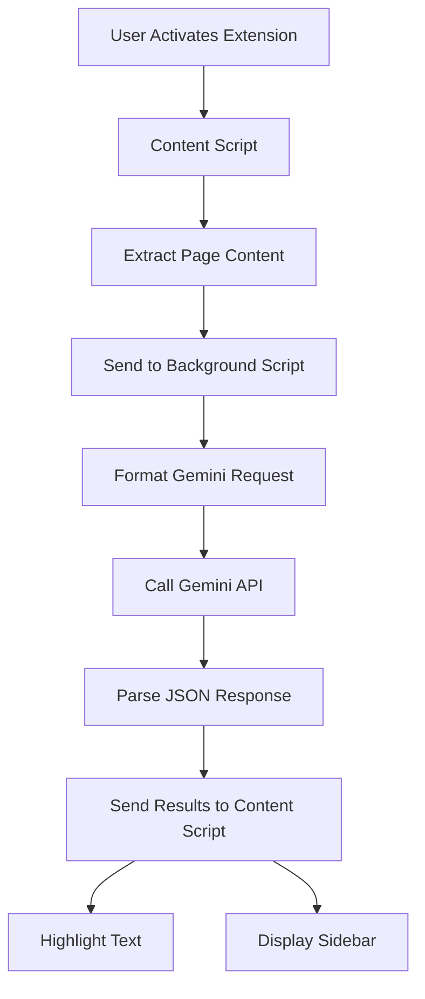

# Golden Nugget Finder - Implementation Plan

## 1. Project Overview

A Chrome extension that leverages Google Gemini AI to extract high-value insights ("golden nuggets") from web content, optimized for users with ADHD who need quick, actionable information synthesis.

## 2. Technology Stack

- **Framework**: Plasmo (Chrome Extension framework)
- **Language**: TypeScript
- **LLM**: Google Gemini API (gemini-2.5-flash model)
- **Content Extraction**: Readability.js for generic pages
- **Storage**: chrome.storage.sync
- **Build Tools**: Vite (included with Plasmo)
- **Testing**: Vitest

## 3. Architecture Design

### 3.1 Component Structure

```
golden-nugget-finder/
├── src/
│   ├── background/
│   │   ├── index.ts           # Service worker entry
│   │   ├── gemini-client.ts   # Gemini API integration
│   │   └── message-handler.ts # Chrome message handling
│   │
│   ├── content/
│   │   ├── index.ts           # Content script entry
│   │   ├── extractors/
│   │   │   ├── base.ts        # Base extractor interface
│   │   │   ├── reddit.ts      # Reddit-specific extractor
│   │   │   ├── hackernews.ts  # HN-specific extractor
│   │   │   └── generic.ts     # Readability.js wrapper
│   │   ├── ui/
│   │   │   ├── highlighter.ts # Text highlighting logic
│   │   │   ├── sidebar.ts     # Results sidebar component
│   │   │   └── notifications.ts # Banner notifications
│   │   └── dom-utils.ts       # DOM manipulation utilities
│   │
│   ├── options/
│   │   ├── index.html         # Options page HTML
│   │   ├── index.ts           # Options page logic
│   │   └── components/
│   │       ├── prompt-editor.ts
│   │       └── api-key-input.ts
│   │
│   ├── popup/
│   │   ├── index.html         # Extension popup HTML
│   │   └── index.ts           # Popup logic
│   │
│   ├── shared/
│   │   ├── types.ts           # TypeScript interfaces
│   │   ├── constants.ts       # Shared constants
│   │   ├── storage.ts         # Storage abstraction
│   │   └── schemas.ts         # JSON schemas for Gemini
│   │
│   └── styles/
│       ├── content.css        # Content script styles
│       ├── sidebar.css        # Sidebar styles
│       └── options.css        # Options page styles
│
├── public/
│   ├── icons/                 # Extension icons
│   └── manifest.json          # Extension manifest
│
├── tests/
│   ├── unit/
│   └── e2e/
│
└── package.json
```

### 3.2 Data Flow Architecture



### 3.3 Core Interfaces

```typescript
// Golden Nugget structure matching the required schema
interface GoldenNugget {
  type: 'tool' | 'media' | 'explanation' | 'analogy' | 'model';
  content: string;
  synthesis: string;
}

interface GeminiResponse {
  golden_nuggets: GoldenNugget[];
}

interface SavedPrompt {
  id: string;
  name: string;
  prompt: string;
  isDefault: boolean;
}

interface ExtensionConfig {
  geminiApiKey: string;
  userPrompts: SavedPrompt[];
}
```

## 4. Implementation Phases

### Phase 1: Foundation (Week 1)
- [ ] Set up Plasmo project structure
- [ ] Configure TypeScript and build pipeline
- [ ] Implement basic manifest.json
- [ ] Create storage abstraction layer
- [ ] Set up message passing between content/background scripts

### Phase 2: Content Extraction (Week 1-2)
- [ ] Implement base extractor interface
- [ ] Create Reddit-specific extractor using provided selectors
- [ ] Create Hacker News extractor using provided selectors
- [ ] Integrate Readability.js for generic pages
- [ ] Test extraction on various websites

### Phase 3: Gemini Integration (Week 2)
- [ ] Implement Gemini API client with structured output
- [ ] Configure response schema based on documentation
- [ ] Handle API authentication and error cases
- [ ] Implement retry logic and rate limiting
- [ ] Test with sample prompts

### Phase 4: UI Components (Week 3)
- [ ] Build notification banner system
- [ ] Implement text highlighting with golden background
- [ ] Create clickable tags/icons for synthesis display
- [ ] Build results sidebar with complete nugget list
- [ ] Style all UI components

### Phase 5: Prompt Management (Week 3-4)
- [ ] Create options page UI
- [ ] Implement prompt CRUD operations
- [ ] Add default prompt selection
- [ ] Build extension popup with prompt selection
- [ ] Implement context menu integration

### Phase 6: Polish & Testing (Week 4)
- [ ] Add loading states and error handling
- [ ] Implement "no results" feedback
- [ ] Write unit tests for core logic
- [ ] Create E2E tests for user workflows
- [ ] Performance optimization

## 5. Key Implementation Details

### 5.1 Gemini API Configuration

```typescript
const geminiConfig = {
  model: "gemini-2.5-flash",
  config: {
    responseMimeType: "application/json",
    responseSchema: {
      type: Type.OBJECT,
      properties: {
        golden_nuggets: {
          type: Type.ARRAY,
          items: {
            type: Type.OBJECT,
            properties: {
              type: {
                type: Type.STRING,
                enum: ["tool", "media", "explanation", "analogy", "model"]
              },
              content: {
                type: Type.STRING,
              },
              synthesis: {
                type: Type.STRING,
              }
            },
            required: ["type", "content", "synthesis"]
          }
        }
      },
      required: ["golden_nuggets"]
    },
    thinkingConfig: {
      thinkingBudget: -1
    }
  }
};
```

### 5.2 Content Extraction Strategy

1. **Site Detection**: Check current URL against known patterns
2. **Selector Priority**:
   - Reddit: `[slot='text-body']` for posts, `[slot='comment']` for comments
   - Hacker News: `.toptext` for posts, `.comment` for comments
   - Others: Use Readability.js
3. **Text Compilation**: Concatenate all extracted text with proper formatting

### 5.3 Highlighting Implementation

```typescript
// Fuzzy text matching for locating nuggets in DOM
function findAndHighlight(nuggetContent: string, rootElement: Element) {
  // 1. Normalize text (remove extra whitespace, punctuation)
  // 2. Use TreeWalker to find text nodes
  // 3. Apply highlight with data attributes
  // 4. Inject clickable icon/tag
}
```

### 5.4 Storage Schema

```typescript
const STORAGE_KEYS = {
  API_KEY: 'geminiApiKey',
  PROMPTS: 'userPrompts',
  LAST_ANALYSIS: 'lastAnalysisResults'
} as const;
```

## 6. Security Considerations

1. **API Key Storage**: Encrypt API key before storing
2. **Content Security Policy**: Configure CSP for injected content
3. **Input Sanitization**: Sanitize all user inputs and LLM responses
4. **Permission Scope**: Request minimal permissions in manifest

## 7. Performance Optimizations

1. **Lazy Loading**: Load UI components only when needed
2. **Debouncing**: Debounce API calls during rapid activations
3. **Caching**: Cache analysis results for recently visited pages
4. **Chunking**: Process large pages in chunks to avoid blocking

## 8. Testing Strategy

### Unit Tests
- Content extractors for each site type
- Gemini API client with mocked responses
- Storage operations
- Text highlighting logic

### Integration Tests
- Message passing between scripts
- Full analysis workflow
- UI component interactions

### E2E Tests
- Complete user journey from activation to results
- Multi-prompt switching
- Options page configuration

## 9. Development Workflow

1. **Local Development**: Use Plasmo dev server with hot reload
2. **API Testing**: Create test harness with sample content
3. **UI Development**: Use Storybook for isolated component development
4. **Version Control**: Semantic versioning with conventional commits

## 10. Deployment Checklist

- [ ] Remove all console.logs and debug code
- [ ] Minify and optimize bundle size
- [ ] Test on multiple Chrome versions
- [ ] Create promotional assets for Chrome Web Store
- [ ] Write comprehensive user documentation
- [ ] Set up error monitoring (Sentry)

## 11. Future Enhancements

1. **Batch Processing**: Analyze multiple tabs simultaneously
2. **Export Features**: Save nuggets to Notion, Obsidian, etc.
3. **Custom Extractors**: User-defined selectors for new sites
4. **Offline Mode**: Cache prompts and recent analyses
5. **Cross-Browser**: Port to Firefox and Edge

## 12. Risk Mitigation

| Risk | Mitigation Strategy |
|------|-------------------|
| Site structure changes | Implement fallback extractors and monitoring |
| API rate limits | Add queuing and user notifications |
| Large content overwhelming LLM | Implement content chunking and summarization |
| Poor nugget quality | Allow user feedback and prompt refinement |

## 13. Success Metrics

- Analysis completion time < 3 seconds
- Successful highlight rate > 80%
- Zero API key exposure incidents
- User satisfaction score > 4.5/5

This implementation plan provides a roadmap for building the Golden Nugget Finder extension with a focus on reliability, performance, and user experience.