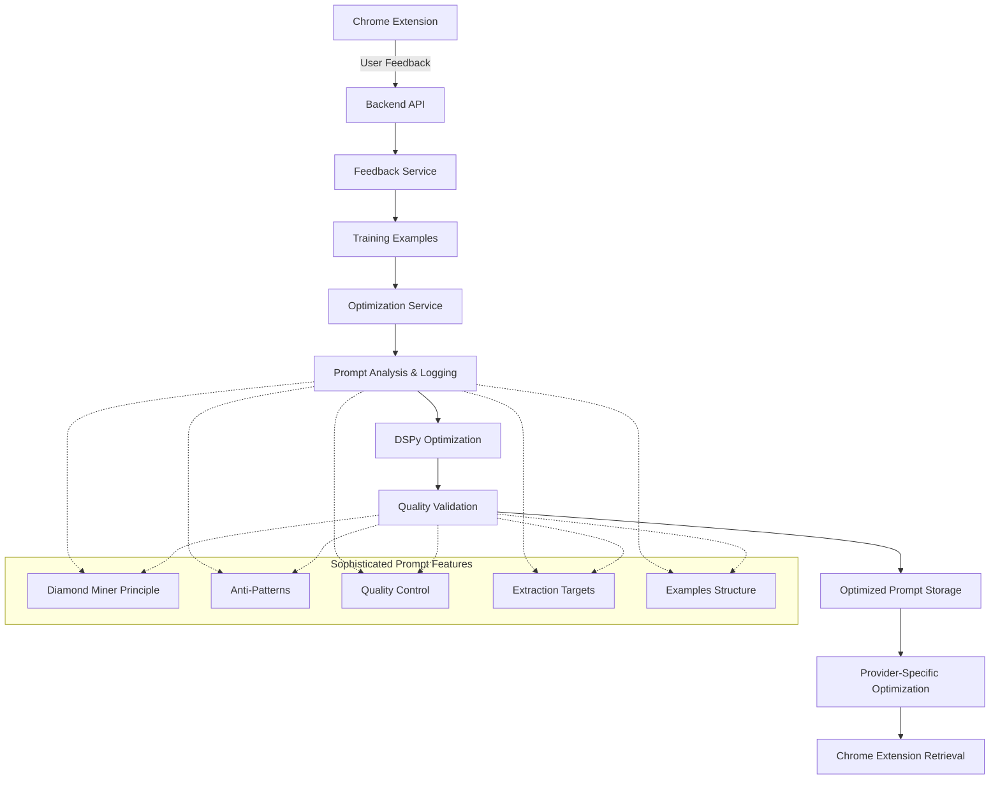

# Prompt Optimization Architecture

## Overview

This document describes the corrected prompt optimization architecture that ensures DSPy optimizes the actual sophisticated Chrome extension prompts instead of ignoring them for a simple baseline.

## Problem Fixed

**Previous Issue**: DSPy was optimizing a simple baseline prompt instead of the sophisticated Chrome extension DEFAULT_PROMPTS that contain advanced engineering like the Diamond Miner Principle, anti-patterns, and quality control heuristics.

**Solution**: Modified the optimization service to use the actual Chrome extension prompt as the optimization target, with comprehensive logging and validation to ensure sophisticated engineering is preserved.

## Architecture Components

### 1. Chrome Extension DEFAULT_PROMPTS Source

**Location**: `/src/shared/constants.ts`

The Chrome extension contains sophisticated prompts with advanced engineering:

```typescript
export const DEFAULT_PROMPTS = [
  {
    id: "default-insights",
    name: "Find Key Insights", 
    prompt: `## ROLE & GOAL:
You are an extremely discerning AI information filter...

## CRITICAL HEURISTICS & ANTI-PATTERNS:

1. **The Diamond Miner Principle (Your Core Heuristic):** Think of yourself as a diamond miner sifting through tons of rock...

## QUALITY CONTROL (APPLY RIGOROUSLY):
1. **Strict Filtering:** For each potential nugget, ask: "Is this genuinely insightful, non-obvious, and high-signal for the persona?"...
`,
    isDefault: true,
  },
]
```

**Sophisticated Features**:
- Diamond Miner Principle (precision over recall)
- Anti-patterns with WRONG/RIGHT examples
- Quality control heuristics
- Structured extraction targets with Bad/Good examples
- Role & Goal definition
- Extraction focus guidelines

### 2. Backend Optimization Service

**Location**: `/backend/app/services/optimization_service.py`

#### Key Changes Made:

1. **Chrome Extension Prompt Integration**:
   ```python
   def __init__(self):
       # Chrome Extension DEFAULT_PROMPTS (sophisticated, engineered prompt)
       self.chrome_extension_default_prompt = """## ROLE & GOAL:
       You are an extremely discerning AI information filter...
       """
       
       # Simple baseline for fallback (deprecated - should not be used)  
       self.baseline_prompt = """Simple baseline prompt..."""
   ```

2. **Comprehensive Logging**:
   ```python
   def _log_prompt_analysis(self, prompt: str, run_id: str) -> dict:
       """Analyze and log characteristics of the prompt being optimized"""
       analysis = {
           "has_diamond_miner_principle": "Diamond Miner Principle" in prompt,
           "has_anti_patterns": "Anti-Pattern" in prompt,
           "has_quality_control": "QUALITY CONTROL" in prompt,
           # ... more sophisticated feature detection
       }
   ```

3. **Quality Validation**:
   ```python
   def _validate_optimized_prompt_quality(self, original_prompt: str, optimized_prompt: str, run_id: str) -> dict:
       """Validate that optimized prompt maintains sophisticated engineering"""
   ```

### 3. Data Flow Architecture



### 4. Prompt Lifecycle Tracking

#### Phase 1: Prompt Identification
```python
logger.info(
    "📝 Prompt optimization target identified",
    extra={
        "run_id": run_id,
        "prompt_type": "chrome_extension_sophisticated",
        "uses_chrome_extension_default": True,
        "has_diamond_miner_principle": True,
        "has_anti_patterns": True,
        "has_quality_control": True,
    },
)
```

#### Phase 2: DSPy Optimization
```python
logger.info(
    "🧠 Starting DSPy optimization with Chrome extension prompt",
    extra={
        "run_id": run_id,
        "optimizing_chrome_prompt": True,
        "prompt_engineering_features": {
            "diamond_miner_principle": True,
            "anti_patterns": True,
            "quality_control": True,
            "precision_over_recall": True,
        },
    },
)
```

#### Phase 3: Quality Validation
```python
logger.info(
    "✅ Optimized prompt maintains sophisticated engineering" if quality_preserved else "⚠️ Prompt quality concerns detected",
    extra={
        "run_id": run_id,
        "quality_preservation": quality_preservation,
        "sophisticated_engineering_maintained": quality_preserved,
    },
)
```

### 5. Provider-Specific Optimization

The system supports provider-specific optimization while maintaining sophisticated engineering:

```python
async def run_provider_optimization(
    self,
    db: aiosqlite.Connection,
    provider_id: str,
    mode: str = "cheap",
    auto_trigger: bool = False,
) -> dict:
    """Run DSPy optimization for a specific provider using Chrome extension prompt"""
    return await self.multi_model_manager.optimize_for_provider(
        db, provider_id, mode, auto_trigger
    )
```

**Supported Providers**:
- Google Gemini
- OpenAI GPT
- Anthropic Claude
- OpenRouter

### 6. Fallback Strategy

When DSPy optimization fails, the system preserves sophisticated engineering:

```python
# Return enhanced Chrome extension prompt if optimization fails
enhanced_prompt = f"""{self.chrome_extension_default_prompt}

# Enhanced with feedback analysis
# Based on {len(training_examples)} user feedback examples, focus on:
# - High-quality content that users find valuable
# - Avoiding content that received negative feedback  
# - Including user-identified missing golden nuggets
# - Maintaining Diamond Miner Principle and quality control heuristics

Return valid JSON with the exact structure: {{"golden_nuggets": [...]}}"""
```

## Quality Assurance

### 1. Sophisticated Feature Detection

The system automatically detects and validates sophisticated engineering features:

```python
analysis = {
    "has_diamond_miner_principle": "Diamond Miner Principle" in prompt,
    "has_anti_patterns": "Anti-Pattern" in prompt, 
    "has_quality_control": "QUALITY CONTROL" in prompt,
    "has_extraction_targets": "EXTRACTION TARGETS" in prompt,
    "has_role_and_goal": "ROLE & GOAL" in prompt,
    "mentions_precision_over_recall": "precision over recall" in prompt,
    "uses_examples": "**Bad:**" in prompt and "**Good:**" in prompt,
    "sophisticated_engineering": True,
}
```

### 2. Quality Preservation Validation

After optimization, the system validates that key features are preserved:

```python
quality_preservation = {
    "preserved_diamond_miner_principle": (
        original_analysis["has_diamond_miner_principle"] and
        (optimized_analysis["has_diamond_miner_principle"] or "diamond miner" in optimized_prompt.lower())
    ),
    "preserved_anti_patterns": ...,
    "preserved_quality_control": ...,
    "preserved_precision_over_recall": ...,
}
```

### 3. Testing Strategy

**Integration Tests**:
- End-to-end optimization with Chrome extension prompts
- Provider-specific optimization validation
- Multiple prompt optimization independence
- Backward compatibility with existing feedback

**Unit Tests**:
- Sophisticated feature detection
- Quality validation logic
- Prompt analysis accuracy
- Fallback preservation

## API Endpoints

### Get Current Optimized Prompt

```http
GET /api/optimization/current-prompt/{provider_id}/{model_name}
```

**Response**:
```json
{
  "id": "prompt-uuid",
  "version": 3,
  "prompt": "## ROLE & GOAL: [optimized sophisticated prompt]",
  "optimizationDate": "2024-01-15T10:30:00Z",
  "performance": {
    "feedbackCount": 150,
    "positiveRate": 0.87
  },
  "providerSpecific": true,
  "modelProvider": "gemini",
  "modelName": "gemini-2.5-flash"
}
```

### Run Provider Optimization

```http
POST /api/optimization/providers/{provider_id}/optimize
```

**Request**:
```json
{
  "mode": "cheap",
  "auto_trigger": false
}
```

**Response**:
```json
{
  "success": true,
  "run_id": "opt-run-uuid",
  "optimized_prompt_id": "prompt-uuid",
  "performance_improvement": 0.15,
  "training_examples": 45,
  "mode": "cheap",
  "provider_id": "gemini"
}
```

## Monitoring and Metrics

### Real-time Progress Tracking

```http
GET /monitor/status/{run_id}
```

### Optimization History Analytics

```http  
GET /api/optimization/history?limit=50&days=30&mode=cheap
```

### Health Monitoring

```http
GET /monitor/health
```

**Health Checks**:
- DSPy environment configuration
- Provider API accessibility
- Database connectivity
- Optimization service status
- Prompt quality metrics

## Configuration

### Environment Variables

```bash
# Required for DSPy optimization
GEMINI_API_KEY=your_gemini_key
OPENAI_API_KEY=your_openai_key  
ANTHROPIC_API_KEY=your_anthropic_key
OPENROUTER_API_KEY=your_openrouter_key

# Optimization settings
OPTIMIZATION_MODE=cheap  # or expensive
MIN_FEEDBACK_THRESHOLD=20
AUTO_TRIGGER_ENABLED=true
```

### DSPy Configuration

```python
# Optimization parameters
optimization_params = {
    "expensive": {
        "num_candidates": 10,
        "init_temperature": 0.7,
        "num_threads": 2,
        "max_bootstrapped_demos": 12,
        "max_labeled_demos": 6,
    },
    "cheap": {
        "max_bootstrapped_demos": 8,
        "max_labeled_demos": 4,
        "num_candidate_programs": 6,
        "num_threads": 2,
        "temperature": 0.5,
    },
}
```

## Security Considerations

1. **API Key Management**: All provider API keys are encrypted and stored securely
2. **Rate Limiting**: Optimization requests are rate-limited to prevent abuse
3. **Access Control**: Provider-specific optimizations require proper authentication
4. **Audit Logging**: All optimization activities are logged with detailed context
5. **Data Privacy**: User feedback is anonymized and used only for optimization

## Performance Considerations

1. **Optimization Threading**: Limited to 2 concurrent optimizations to prevent resource exhaustion
2. **Prompt Caching**: Optimized prompts are cached for fast retrieval
3. **Background Processing**: Long-running optimizations are processed in thread pools
4. **Memory Management**: Active runs are cleaned up after 24 hours
5. **Database Optimization**: Indexes on optimization history for fast queries

## Future Enhancements

1. **Multi-Prompt Optimization**: Optimize multiple Chrome extension prompts simultaneously
2. **A/B Testing**: Compare different optimization approaches
3. **Automatic Retraining**: Trigger optimization based on performance degradation
4. **Cross-Provider Learning**: Share optimization insights across providers
5. **Prompt Version Control**: Track prompt evolution over time